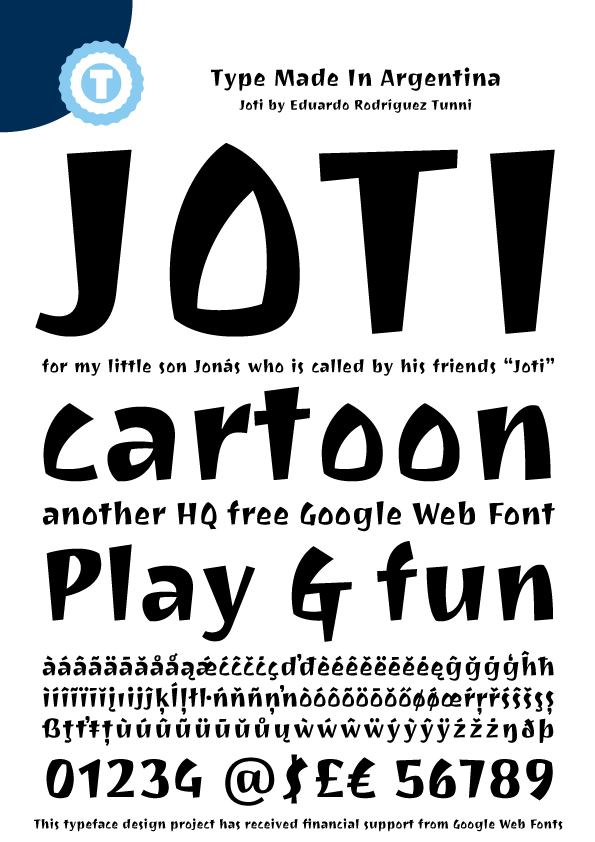

### Joti

I enjoyed designing this typeface because it was inspired by my little son "Jonah," who is called by his friends "Joti." The type has the informality and style of the cartoons which children watch. Its primary concept is top-heavy stems with a slight sense of movement to further enhance the style. Joti is ideal for composing headlines and short texts in sizes larger than 14 points.

### Designer

* Eduardo Rodríguez Tunni

### License

Licensed under the [*SIL Open Font License, 1.1*](http://scripts.sil.org/OFL); you may not use this file except in compliance with the License.

To contribute to the project contact Eduardo Rodríguez Tunni > edu@tipo.net.ar
